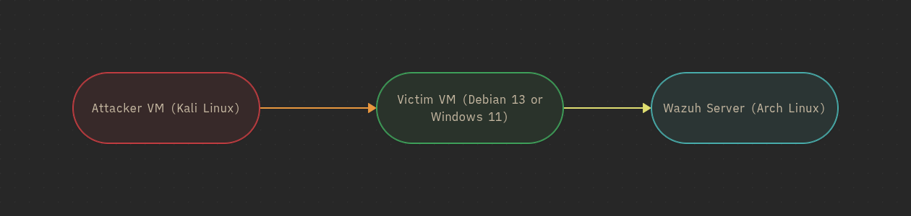

# Wazuh HomeLab

My Personal Wazuh Home Lab to explore how Wazuh works and learning the concepts of SIEM, EDR/XDR, and many more.

## Architecture

## Scenarios

| #   | Scenario                           | Platform          | MITRE ATT&CK                                  | Severity   | Rule ID   | Status    | Write-up                                                    |
| --- | ---------------------------------- | ----------------- | --------------------------------------------- | ---------- | --------- | --------- | ----------------------------------------------------------- |
| 01  | SSH Brute Force Attack             | Linux (Debian 12) | T1110 – Brute Force (Credential Access)       | 10 – High  | 40111     | Completed | [View](scenarios/01_SSH_Bruteforce/README.md)               |
| 02  | Suspicious File Modification (FIM) | Linux (Debian 12) | T1565.001 – Stored Data Manipulation (Impact) | 7 – Medium | 550 (554) | Completed | [View](scenarios/02_Suspicious_File_Modification/README.md) |

### Linux Scenarios

| #   | Scenario                                                                                  | Technique                            | Status    |
| --- | ----------------------------------------------------------------------------------------- | ------------------------------------ | --------- |
| 01  | [SSH Brute Force Attack](scenarios/01_SSH_Bruteforce/README.md)                           | T1110 – Brute Force                  | Completed |
| 02  | [Suspicious File Modification (FIM)](scenarios/02_Suspicious_File_Modification/README.md) | T1565.001 – Stored Data Manipulation | Completed |

### Windows Scenarios

| #   | Scenario                                 | Technique | Status  |
| --- | ---------------------------------------- | --------- | ------- |
| –   | _No Windows scenarios yet – coming soon_ | –         | Planned |

<!-- To add a new scenario: copy scenarios/_template/, create scenarios/02_Your_Scenario/, and add a row to the tables above -->
