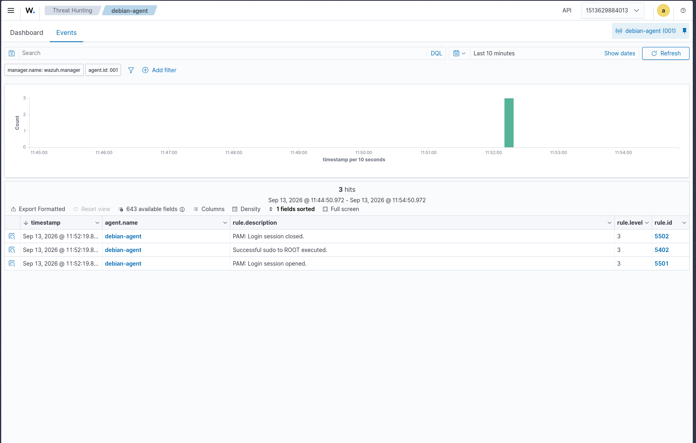
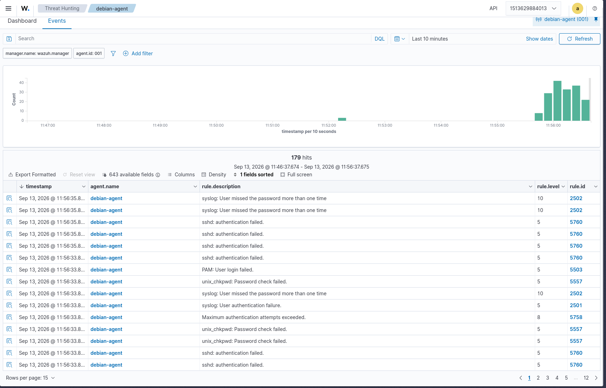
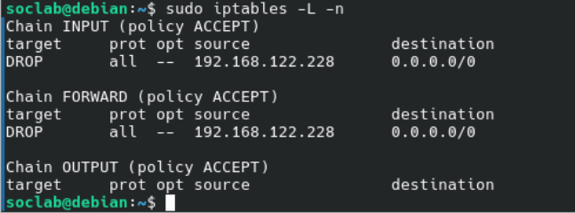
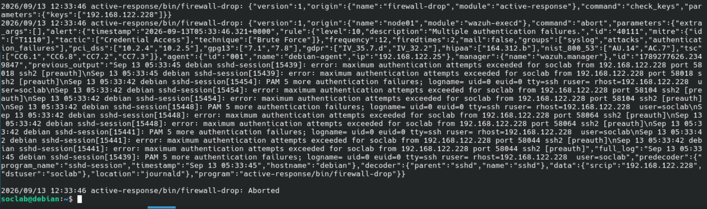

# Scenario 01: SSH Brute Force Attack

## Objective

Demonstrating the detection of an automated SSH dictionary attack against a Linux endpoint using Wazuh.

## Incident Overview

| Attribute                  | Detail                                                 |
| :------------------------- | :----------------------------------------------------- |
| **MITRE ATT&CK Tactic**    | Credential Access                                      |
| **MITRE ATT&CK Technique** | T1110 - Brute Force                                    |
| **Severity Level**         | 10 - High                                              |
| **Primary Rule ID**        | 40111                                                  |
| **Target OS**              | Debian 12 VM (`debian-agent`, `001`, `192.168.122.25`) |

---

## 1. Attack Execution (Red Team)

An automated dictionary attack was launched from the Kali Linux attacker machine (`192.168.122.228`) targeting the local user `soclab` on the Debian 12 agent.

**Command / Tool Used:**

```bash
hydra -l soclab -P /usr/share/wordlists/fasttrack.txt ssh://192.168.122.25
```

---

## 2. Detection & Evidence (Blue Team)

The Wazuh agent successfully intercepted the malicious traffic via the `journald` logs on the target endpoint. The system detected sequential Pluggable Authentication Modules (PAM) failures and aggressive connection terminations by the SSH daemon due to exceeded authentication limits.

**Visual Evidence:**

Before attack (quiet baseline):<br>


After attack (alerts firing):<br>


**Log Artifacts:**

1. Multiple authentication failures — `2026-09-13T04:56:31.845Z`, `srcip: 192.168.122.228`, `dstuser: soclab`, `frequency: 12`, `firedtimes: 8`, `location: journald`, `decoder: sshd`:

> Review the raw JSON artifact: [scenario1_ssh_brute_force.json](./scenario1_ssh_brute_force.json)

**SOC Investigation (Identify -> Document):**

| Step            | Finding                                                                                                                              |
| :-------------- | :----------------------------------------------------------------------------------------------------------------------------------- |
| **Identify**    | Multiple authentication failures, Rule 40111, Level 10, `location: journald`, `groups: syslog,attacks,authentication_failures`        |
| **Validate**    | True Positive — timestamps match controlled Hydra run from Kali                                                                      |
| **Investigate** | Target `debian-agent (001 / 192.168.122.25)`, `dstuser: soclab`, source `192.168.122.228`, `decoder: sshd`, PAM + `maximum authentication attempts exceeded` |
| **Correlate**   | Sequential PAM failures + SSHD `preauth` disconnects in `previous_output`, `firedtimes: 8` shows repeated triggering                 |
| **Scope**       | Isolated — query `data.srcip: 192.168.122.228` returns only `debian-agent`. No other hosts affected                                  |
| **Respond**     | See Section 4                                                                                                                        |
| **Document**    | Screenshots + JSON export in this folder                                                                                             |

---

## 3. Root Cause Analysis

The SSH service on the target endpoint was exposed to the local network with password-based authentication enabled. This configuration, combined with the lack of immediate rate-limiting at the host level, allowed an external actor to rapidly submit automated credential guesses without the connection being dropped.

---

## 4. Remediation & Response

- **Immediate Action (Active Response):** To transition from passive detection to active defense, automated containment was configured using Wazuh Active Response:

  1. Configure Manager Command Action — updated the Wazuh Manager configuration (running via Docker on the Arch Linux host) to link Rule 40111 with the firewall-drop script:

     ```xml
     <active-response>
       <command>firewall-drop</command>
       <location>local</location>
       <rules_id>40111</rules_id>
       <timeout>180</timeout>
     </active-response>
     ```

  2. Verify Agent Prerequisites — ensured iptables was installed and active on the Debian 12 endpoint:

     ```bash
     sudo apt install iptables -y
     ```

  3. Trigger and Validate Containment — re-ran the Hydra simulation from Kali. Upon reaching the Rule 40111 threshold, the agent executed the script, dropped the attacker's connection, and quarantined the IP.

  **Validation Evidence:**

  Firewall Rule Drop Verification:<br>
  

  Active Response Execution Log:<br>
  

- **Long-term Fix:** Modify `/etc/ssh/sshd_config` on the Debian endpoint to disable password authentication entirely (`PasswordAuthentication no`) and enforce strict public key cryptography (e.g., `ed25519` keys).
