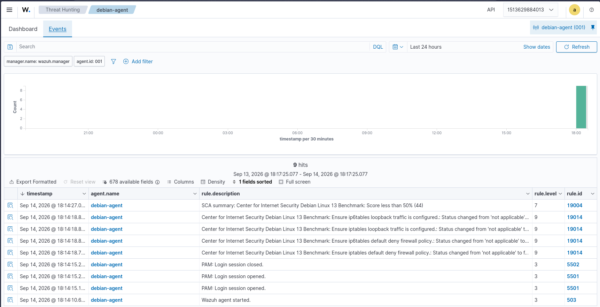

# Scenario 02: Suspicious File Modification (FIM)

## Objective

Demonstrating File Integrity Monitoring detection of unauthorized content and permission changes to a monitored file on a Linux endpoint using Wazuh realtime syscheck.

## Incident Overview

| Attribute                  | Detail                                                 |
| :------------------------- | :----------------------------------------------------- |
| **MITRE ATT&CK Tactic**    | Impact                                                 |
| **MITRE ATT&CK Technique** | T1565.001 - Stored Data Manipulation                   |
| **Severity Level**         | 7 - Medium                                             |
| **Primary Rule ID**        | 550 (554 for file creation)                            |
| **Target OS**              | Debian 12 VM (`debian-agent`, `001`, `192.168.122.25`) |

---

## 1. Attack Execution (Red Team)

A monitored test file was created to establish a baseline, then modified in two controlled steps simulating an attacker leaving persistence artifacts and weakening permissions.

**Setup / Baseline:**

```bash
sudo mkdir -p /tmp/fim-test
echo "baseline v1 - soc lab $(date -u)" | sudo tee /tmp/fim-test/test.txt
sudo stat /tmp/fim-test/test.txt
sudo sha256sum /tmp/fim-test/test.txt
```

**Modification 1 - Content append (simulated attacker):**

```bash
echo "kali persistence Mon Sep 14 12:19:33 PM UTC 2026" | sudo tee -a /tmp/fim-test/test.txt
```

**Modification 2 - Permission weakening:**

```bash
sudo chmod 777 /tmp/fim-test/test.txt
```

**FIM Configuration (Manager - Arch Linux Docker host):**

Dashboard has no `Edit centralized configuration` button in current versions, so shared config was edited directly in the Manager container at `/var/ossec/etc/shared/default/agent.conf`:

```xml
<agent_config>
  <syscheck>
    <directories realtime="yes" report_changes="yes">/tmp/fim-test</directories>
  </syscheck>
</agent_config>
```

Then on Debian:

```bash
sudo mkdir -p /tmp/fim-test
sudo systemctl restart wazuh-agent
```

> Note: `whodata="yes"` was initially tried but `syscheckd` logged `unable to audit rule for /tmp/fim-test`. `auditd` cannot place watches on `/tmp` (tmpfs) on Debian 12. Fix was `realtime + report_changes` without `whodata` for `/tmp`. For full user/process attribution in production, monitor an ext4 path such as `/opt/fim-test` with `whodata="yes"` (requires `auditd` active).

---

## 2. Detection & Evidence (Blue Team)

Wazuh `syscheckd` in `realtime` mode detected the baseline file creation (Rule 554) followed by two Rule 550 modifications. `report_changes=yes` captured the exact diff.

**Visual Evidence:**

Before monitoring (empty inventory for path):<br>


File added + checksum changed events in FIM module:<br>


Threat Hunting correlation (`agent.name: debian-agent AND syscheck.path: "/tmp/fim-test/test.txt"`):<br>


Endpoint terminal proof (stat / hash before vs after):<br>


**Log Artifacts:**

1. Content modification — `2026-09-14T12:19:36.015Z`, size `54 -> 103`, `sha256_before: c31b23...` -> `sha256_after: d03234...`, diff: `kali persistence Mon Sep 14 12:19:33 PM UTC 2026`, `changed_attributes: size,mtime,md5,sha1,sha256`:

> Review the raw JSON artifact: [scenario2_FIM_attribute_changed.json](./scenario2_FIM_attribute_changed.json)

2. Permission modification — `2026-09-14T12:20:28.877Z`, `perm_before: rw-r--r--` -> `perm_after: rwxrwxrwx`, `changed_attributes: permission`, `No content changes`:

> Review the raw JSON artifact: [scenario2_FIM_permissions.json](./scenario2_FIM_permissions.json)

**SOC Investigation (Identify -> Document):**

| Step            | Finding                                                                                                                                                                          |
| :-------------- | :------------------------------------------------------------------------------------------------------------------------------------------------------------------------------- |
| **Identify**    | File `/tmp/fim-test/test.txt` modified, Rule 550, Level 7, `location: syscheck`, `mode: realtime`                                                                                |
| **Validate**    | True Positive — timestamps match controlled `tee` / `chmod` commands above                                                                                                       |
| **Investigate** | Endpoint `debian-agent (001 / 192.168.122.25)`, `uid_after: 0 / uname_after: root`, inode `173`. No `audit.user/process` due to `whodata` limitation on `/tmp` (see config note) |
| **Correlate**   | Creation (554) -> content change (550) -> permission change (550), `firedtimes 3 -> 4`, same `sha256_after` links the two 550 events to same file state                          |
| **Scope**       | Isolated — query `syscheck.path: "/tmp/fim-test/test.txt"` returns only `debian-agent`. No other hosts affected                                                                  |
| **Respond**     | See Section 4                                                                                                                                                                    |
| **Document**    | Screenshots + 2x JSON exports in this folder                                                                                                                                     |

---

## 3. Root Cause Analysis

The file was writable by a privileged user and monitored in `realtime`, so any write or `chmod` immediately triggered a checksum comparison against the baseline (`md5/sha1/sha256` + `size/mtime/perm`).

Two distinct weaknesses demonstrated:

1. **Unauthorized content change:** Baseline `54 bytes` grew to `103 bytes` with attacker-controlled string. Without FIM + `report_changes`, this append would be invisible in auth logs.
2. **Permission weakening:** `644 -> 777` makes the file world-writable/executable — classic persistence / privilege-escalation prep (T1222-adjacent behavior, detected here as T1565.001 attribute change).

The `whodata / unable to audit rule` error is itself a finding: `/tmp` on tmpfs cannot provide audit-based user/process attribution. That answers `What process caused it?` with `unknown` unless monitoring is moved to an auditable filesystem.

---

## 4. Remediation & Response

- **Immediate Action:** Verify content with `cat /tmp/fim-test/test.txt`, compare `sha256sum` to known-good baseline. Remove test artifact after lab: `sudo rm -rf /tmp/fim-test`. If unexpected in production: isolate host, kill related PIDs, review `journald` / `auth.log` for same time window (`2026-09-14T12:19-12:20Z`).
- **Long-term Fix:**
  - Monitor critical paths only with `realtime + report_changes + whodata`: `/etc/passwd`, `/etc/shadow`, `/etc/ssh/sshd_config`, `/usr/bin`, `/usr/sbin`.
  - Do not use `/tmp` with `whodata` — use `/opt/fim-test` or similar ext4 path + `auditd` enabled (`sudo apt install auditd -y && sudo systemctl enable --now auditd`) for full `audit.user / audit.process` attribution.
  - Tune Rule 550: alert on `root` writes immediately, ignore expected automation users to reduce FPs. Pair FIM 550 with SCA to catch `777` permission drift automatically.
